# Rental Car

Rental Car is a full-stack website that offers a convenient latform for renting cars. Whether your planning a vacation, a buisness trip, or just simply need a vehicle, rental car provides a quick and easy booking experience.

Rentl Car website features a database of cars, ranging from compact SUVs to luxury vehicles. Users can filter cars based on their desired specifitcations to get  a better group of ideal vehicles. 

The landing page welcomes users with a functional search bar with search suggestions, allowing them to quickly find their desired car. Popular cars and recently viewed vehicles are also showcased, providing users with convienence and options for their rental choices.

Once users have found their preferred car, they can view detailed information about the vehicle. Upon pressing on a car they willl be directed to the single page which showcases its features, specifications, and availability. The single view page provides an interactive calendar for bookings and view alerady rented dats. Users can also view a review section with feedback from previous renters. A  user can leave a meaningful review with a bold header, rating, and a breid description.

The checkout process is straightforward, guiding users through the booking confirmation and generating a purchase ticket. Payment processing is not currently available, the system still created the booking, updating the car's availability.

Admins have an exclusive panel in which they can view recently purchased cars as well as a pie chart of the top 5 cars. Admins have access to admin tools such as adding new cars.

Experience the convenience and flexibility of renting a car with Rental Car. Explore our vast selection of vehicles, book with confidence, and embark on your next journey with ease.

## Technologies Used

- **Front-end**: HTML, CSS, JavaScript, React, Redux
- **Back-end**: Node.js, Express.js, Sequelize (MySQL)
- **Authentication**: bcrypt, JWT (JSON Web Tokens)
- **Other Tools**: Git, GitHub, Postman

## Installation

To run the project locally, follow these steps:

1. Clone the repository.
2. Install the dependencies using npm or yarn.
3. Set up the database and configure the connection.
4. CD to the server and run the seeds
4. Start the development server.
5. Access the website through your preferred browser.

## Pages

## Pages

### Landing Page

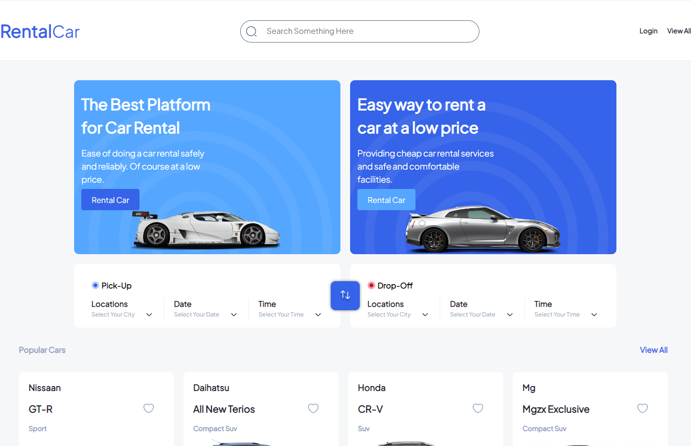
*Figure 1: Landing Page*

The user is greeted with a functional search bar and a brief introduction of what this site stands for.

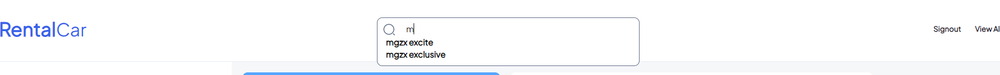
*Figure 2: Search Suggestions*

### Main Page

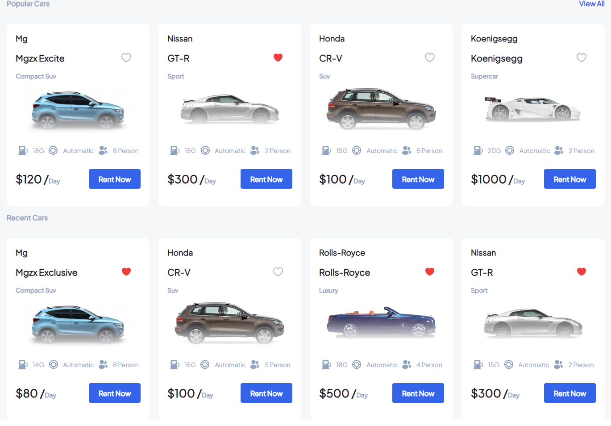
*Figure 2: Recent-Popular Page*

Users can scroll down and find a section for popular cars and recent cars. The popular cars are calculated by the server, while the recent cars are temporarily stored in local storage.

### Footer

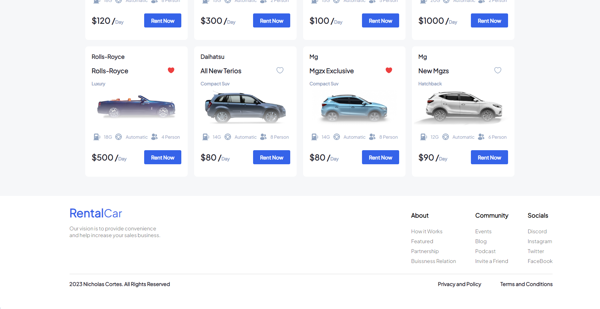
*Figure 3: Footer-Contact Page*

All pages end with a footer section containing a few links.

### Login

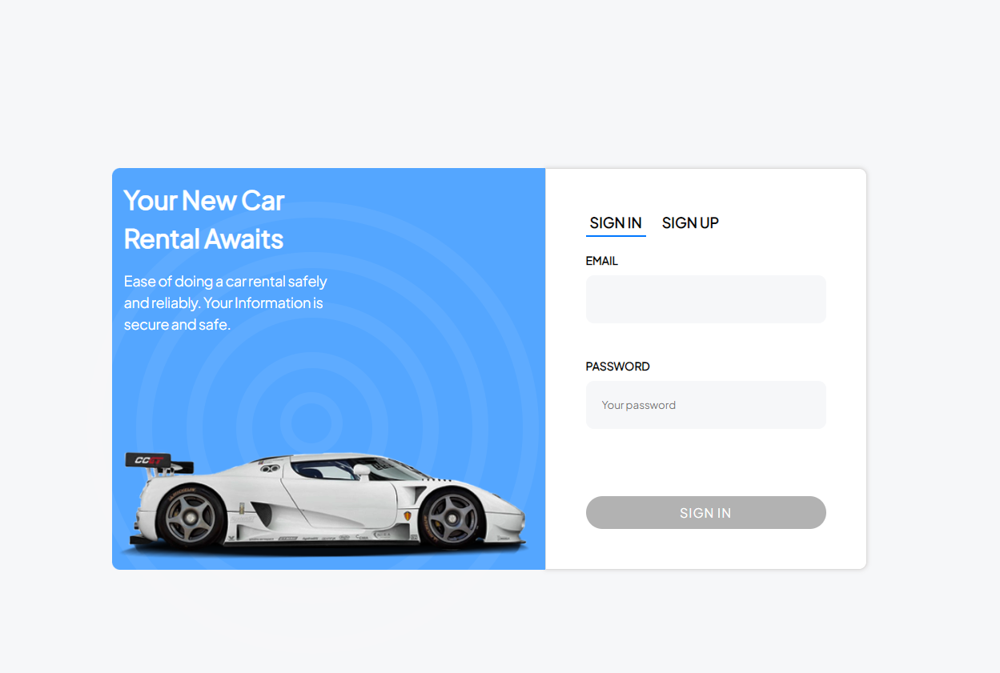
*Figure 4: Login Page*

Users can log in or sign up securely.

## Filter - View All

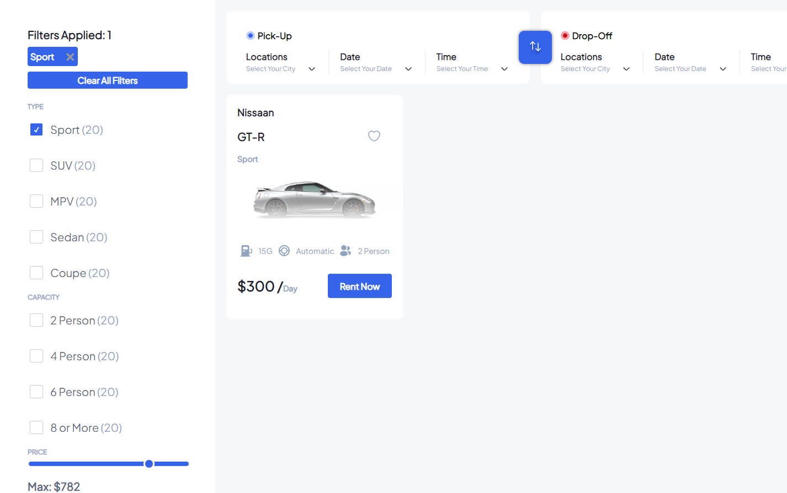
*Figure 5: View All/Filter*

When users are directed to the view all page, they have the option to functionally filter cars. If there is no filter, they can simply view all the cars.

## Single View

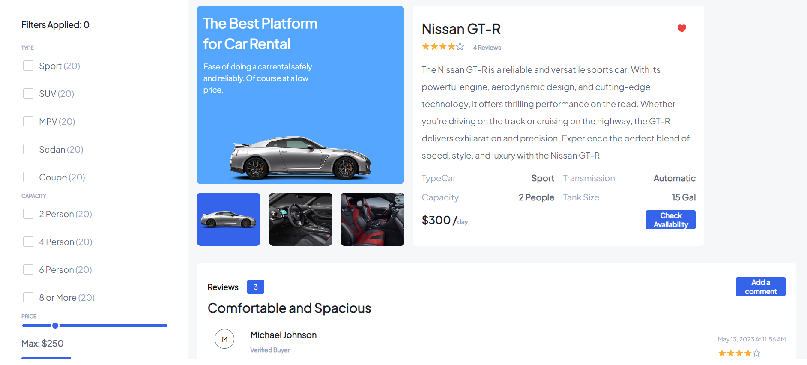
*Figure 6: Single View*

Users can click on a car and be directed to a single view of that car, where they can get more information. They can check availability and interact with a functional calendar. The car's reviews can be viewed below its description. The number of reviews is counted, and the average rating is calculated and displayed in the form of stars.

## Calendar

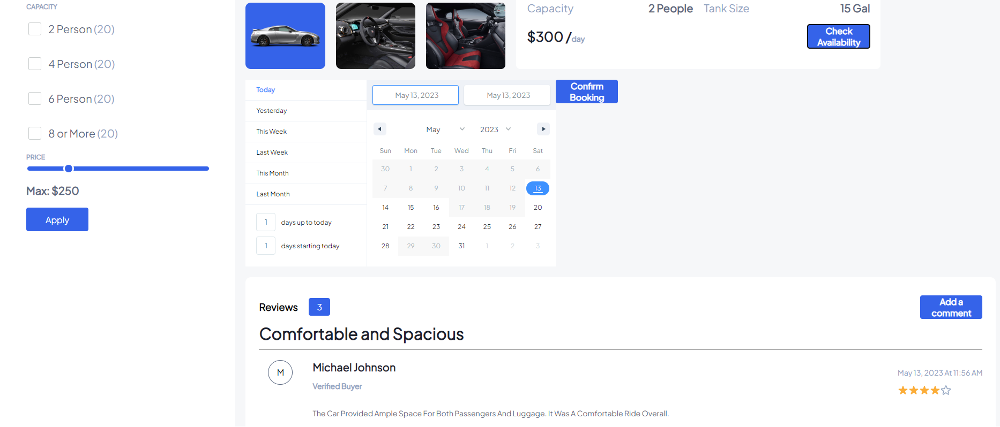
*Figure 7: Calendar View*

Users can select a range of available dates. Dates that have already been booked are disabled and displayed in grey, indicating their unavailability. Users can select dates and confirm their selection to proceed to the checkout pages.

## Reviews

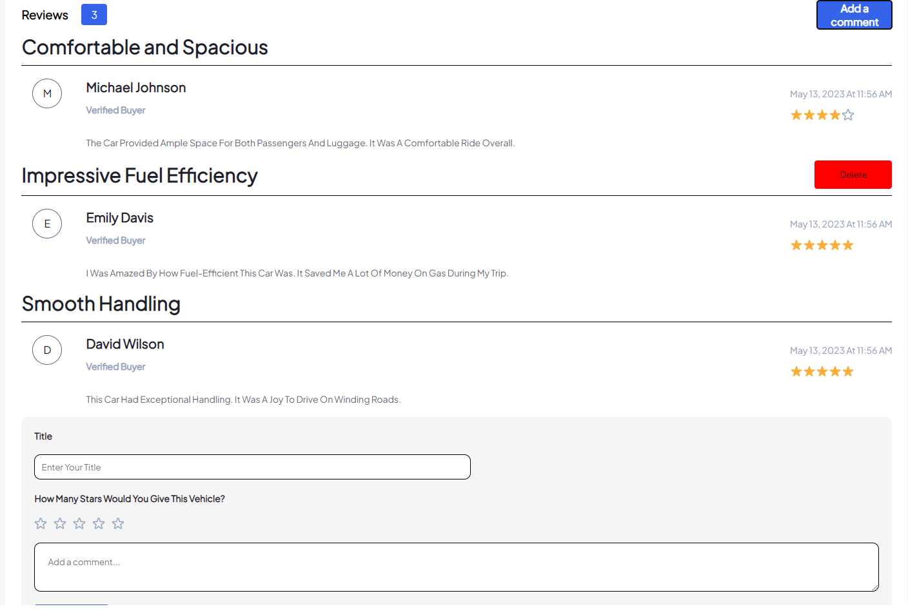
*Figure 8: Review Section*

Users can view reviews made by other users, delete reviews, or add new reviews. The total number of reviews is indicated at the top. Users can rate the car from 1 to 5 stars, add a title, and provide a description.

## Checkout

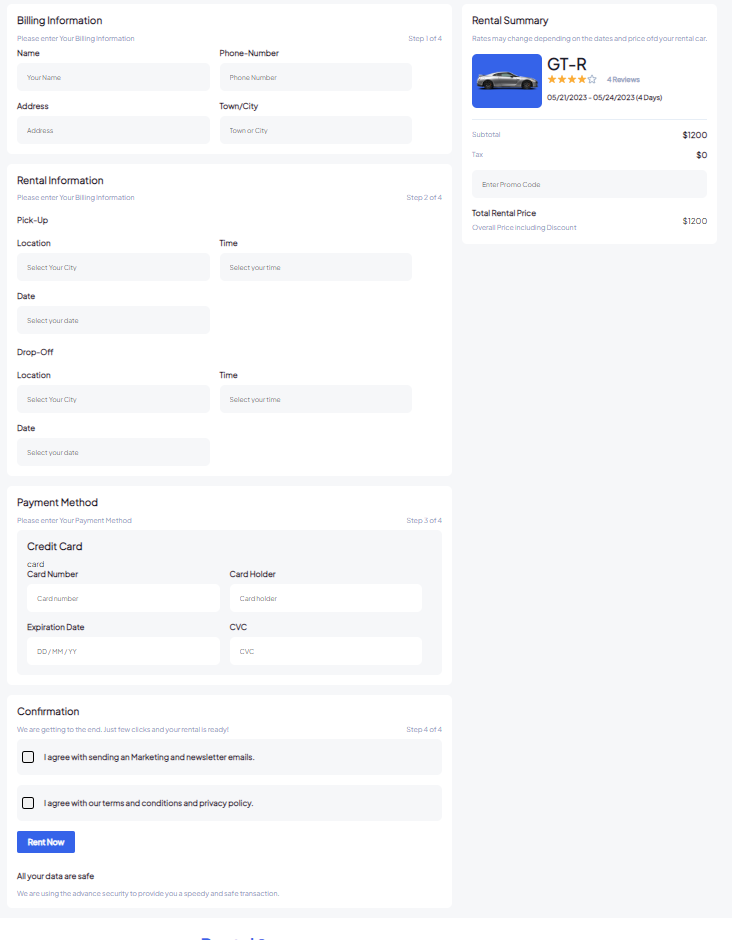
*Figure 9: Checkout Page*

When users have found their desired vehicle and selected their dates, they can proceed to the checkout process. Although there is no current payment processing, a purchase ticket is generated, and the booking is confirmed. The confirmation updates the statistics and the number of days the car is booked.

## Admin Panel

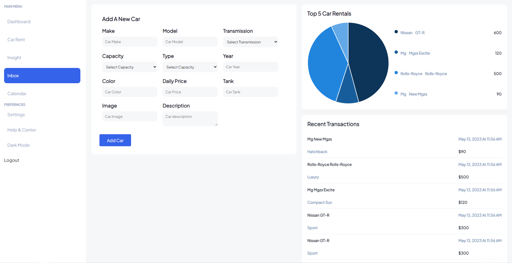
*Figure 10: Admin Panel*

If a user is an admin, they get access to exclusive analytics including the top 5 rentals, recent transactions, and adding a car. These features are functional and calculate the top 5 based on how frequently they are purchased, as per the purchase tickets.

## License

This project is licensed under the MIT License - see the [LICENSE](LICENSE) file for details.

## Credits

- Express: The server framework used for handling HTTP requests and API endpoints. Express
- React Router: The library used for client-side routing and navigation. React Router
- jsonwebtoken: The library used for generating and verifying JSON Web Tokens (JWT) for user authentication.
- React Chart.js: The library used for creating interactive and responsive charts in React applications.
- react-date-range: The library used for displaying and selecting date ranges in React applications. react-date-range
- MySQL: The relational database management system used for storing and retrieving data. MySQL
- Redux: The library used for managing state in React applications. Redux
- react-redux: The official Redux bindings for React, used for integrating Redux with React components. 